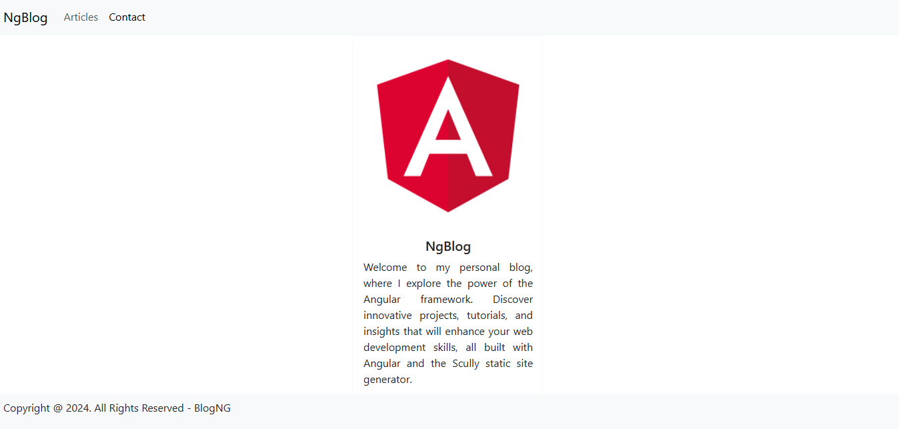
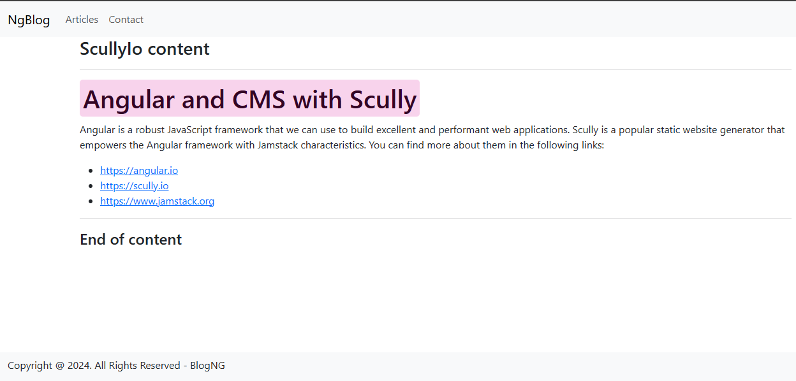

# BlogNg

A personal blog developed with the Angular framework and the Scully static site generator. This project is a platform to share articles, tutorials, and insights on web development.



## Technologies Used

- **Angular**: Framework for building dynamic web applications.
- **Scully**: Static site generator for Angular.
- **RxJS**: Library for reactive programming with observables.

## Features

- Listing of published articles.
- Integration with Scully for static page generation.

## Installation

1. Clone the repository:
   ```bash
   git clone https://github.com/deyvidsalvatore/BlogNg.git
   ```

2. Navigate to the project directory:
   ```bash
   cd BlogNg
   ```

3. Install dependencies:
   ```bash
   npm install
   ```

4. Start the development server:
   ```bash
   ng serve
   ```

5. Open your browser at `http://localhost:4200`.

## Generate Static Site

To generate the static site with Scully, run:
```bash
ng build --prod
npx scully
```

The generated files will be in the `dist` folder.

## Contribution

Contributions are welcome! Feel free to open an issue or submit a pull request.

## License

This project is licensed under the [MIT License](LICENSE).

